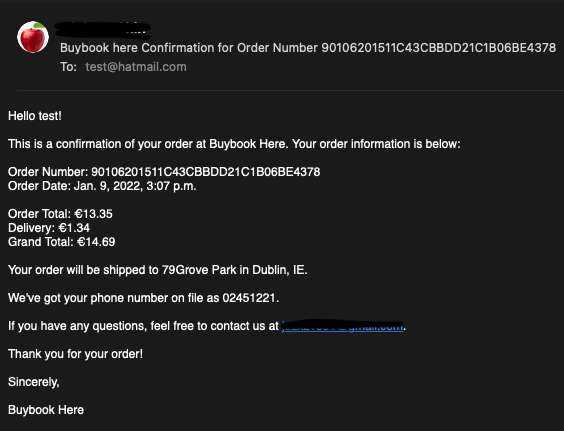
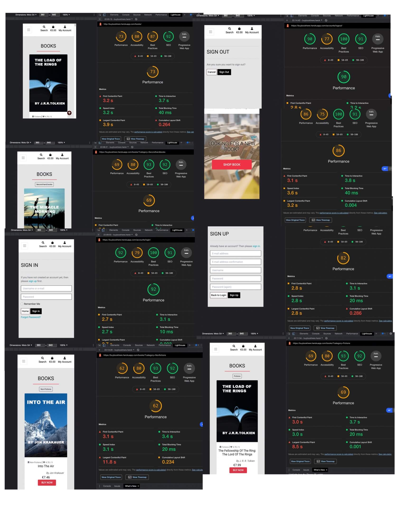
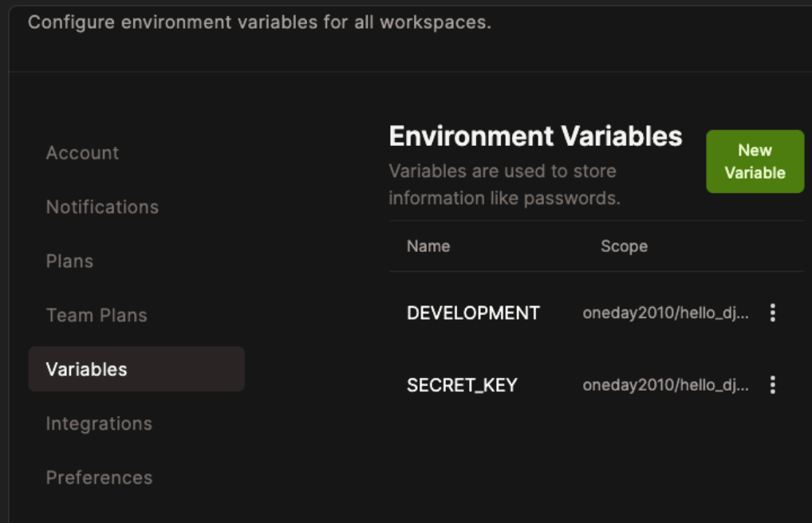

# Buybook here

[View the live project here](https://buybookhere.herokuapp.com/) 

This website is made for users who are interested in shopping for new published books or shop second-hand books. The main aim of the project is to create a user-friendly website that can help users to interact with content and search the information easily, be able to purchase the product through a secure payment method.
It also gets secure confirmation after the order submits. The admin can do managing the products through the website.  Finally, The website is actively working as an e-commerce platform with all essential functions.

---
---
## Table of contents
---

[Overview](#overview)

[Description](#description) 

[Ux](#ux) 

[Features](#features) 

[Technologies](#technologies) 

[Testing](#testing) 

[Deployment](#deployment) 

[Credits](#credits) 

## Overview
---
 Many websites deal with book e-commerce platforms. My main purpose of this website is becoming admin of the website, updating new product(book) through the website and managing inventories within the website. Also, the user who signs up can review him/her profile,order history and secure check out too. I tried to make a simple, easy but reliable e-commerce website. 

## Description
---
 It is a buybookhere website is aim to be a simple and easy e-commerce platform that trade new book as well as second-hand books which can be accessed on all devices. As store owner can do manage the store within the website, as site user also able to signup/login and check the profile. As shopper can search right book for themselves. All basic e-commerce satisfied the purpose of the website. 

## UX

### User experience
---

### Strategy
---

 Main target user : book shopper, book searcher, book dealer, site visitors worldwide.

 The website is aimed to function simple book e-commerce platform. Therefore, main target users are able to signup/login and check their profiles and review their order history. In this way, users feel secure to checkout and revisit the site with better impressions. Visitors can search the book for what they are looking for easily and review the book with simple steps.

####  Business Goals

 1. To provide a professional, clear and easy navigate a website for any type of user, be it, first time user, as well.

 2. Simple book trade e-commerce platform, checkout platform is reliable and confirmed all the checkout record after. Users can sign up on the platform, as the admin can manage inventory and users too. 

 3.  Visitors can easily navigate all the sites and search the book too. 

#### User Stories

  * As first time user

    " I'm just looking for an easy way to search book what I look for, I don't want to register"

    " I want to see the total of my purchases during my shopping"
    
    " I'm not sure I will get free delivery after how much I purchased the book"
    
    "I want to change the mind and remove the books from the shopping bag"

    " I don't know I order the book correctly? I want to check I input the right address and also how much money I paid"

    "Don't remember I sign up this site before"

        

  * As Regular User:
  
    "I want to see my profile on the site because I sign up for the website"

    " I want to check my order history"

    " I don't want to other people see my oder history"

    " I want to change my delivery address and save for next time"

### Scope
---

 - Useful - This website is useful to a visitor who searches new published book and cheap second-handbook. Also, admin user can manage the stock and sign up the user can manage profile and review the order history. 

 - Sellable -  There are many potential fundable possibilities such as a book market and furthermore, challenge the e-book market in future.  In covid situation, more customer want to use e-market, second-hand book items can be great potential customer behind too.

 - Buildable - Fits in with the level of my abilities, limited python usability and javascript function but it can improve in future. Many codes followed the Boutique Ado from code institute course, inspired by  Django prebuilt functions for all basic e-comers function. Use stripe for payment provider and AWS for database management tool. Having difficulty to connected all platforms but followed the course steps.  

 - Objective - user/visitor can use this site as reliable book e-comers platform. As admin, can manage the inventory within website. 

 - Functional - user can log in/log out and register an account. After register the website, the user can review the profile and order history. Admin can upload new book,edit and delate. Also admin can manage users and website function as basic e-comers platform (buy,checkout,get paid, confirmed etc) 

 - Non-Functional  -  Would be better with sorted function by price/review. Also, if user could add review or comment can be potential improve-able  functions. 

 - Business Rules -   Make sure don't share personal user name and password, specially as admin, don't share any information in relate the site ownership. Otherwise, it can be compromised. Make sure not exposed any secret key in relate stripe,AWS. User who did check out get confirmed order and get records to proven. 

 * Main target user : book shopper, book searcher, book dealer, site visitors worldwide.

### Structure
---
1. visitor/non-registered user
welcoming page and books pages(able to search and check the details of book, buy and checkout, confirmed the order and get a confirmation email)
2. login/sign up user
same structure as a non-registered user as well as own profile pages and able to update profile information and check the order history. 
3. Admin user
Able to manage the inventory. Have a book management page only for the admin user. Each book has an edit and delates button for the manage book only admin can access and view.

### Skeleton
---
The website shows three different ways. the non-registered user used the site and the registered user using the site. As well as Admin who is able to manage inventory and has ownership of site get more control of edit, delate and update access. Most of the pages are match with my framework, but I didn't much change of basic frame work and models from Code institute boutique Ado project. I gave bit of front-end change from the original project to give Morden and cheerful looks. 

 
 #### Wireframes

 - Landing Page: welcoming page
 

 - Welcome

 - Home

 - Fictions
 

 - Non-Fictions

 - Second-hand books

 - Login and Profile and management page

 - Checkout and Thank you page

 - Sign up

 

### Surface
—--
I wanted to attracted more younger generation for the website visitor. So, tried to give more colourful and as same time Morden look too. Use red colour for the main attraction colour and grey ,white and black are primary colours for the website. Try not too use many colour which can create confusions. 
Check [colorspace]((https://mycolor.space/?hex=%23352E24&sub=1)) for colour match. Many parts of colours and framework used from bootsrap prebuilted for the card/basic e-commers functions. Can found the reference on the bottom of the readme file. 

 #### Design

   - Images : Each book image is selected from [pixabay](https://pixabay.com/) and  [unsplash]( https://unsplash.com/). All the book titles and authors written by manually. Try to match the image with book contents. 

  - Color Scheme : Use Red for the attraction and emphasising purpose. Gray and Black for the Morden look and try to leave many empty space to not make confusion of the user. Use pre-build color Scheme on toast and give green and red for edit/delate button to easily catch the eyes.  
 
   
  - Typography : I used Google Fonts to get some idea of my website fonts and decided to use “ Roboto” and “Sans-serif” as the backup font. I choose Roboto because it looks more followed trend as modern and minimalism at the same time it looks friendly and reliable.

  - Icons : Font Awesome was my choice to use all icons on my website. Try to use icons that easy to understand the purpose of usage. 

## Features
---

### Navbar 

 -  There is a navbar fixed on the top of all the web pages to give the user better access and navigate the website easily. 

 - search bar on the top inside navbar can assite user to search book in any pages

 - shopping bag help to visual of total amount of checkout. 
 - Account button has login/signup ( For the admin account has book manager too). So user can easily login/singup/my profile/book manager. 

 - show four main pages( BOOKS/FICTIONS/NON-FINCTIONS/SECOND_HAND BOOKS)
easily navigate the each pages. 

### Welcome (Home)

 - Welcoming page with shop book button which lead to main books page.

### Books 

 - Shows all inventory on the website ( all the books registered)

 - each books have a button to go book detail( click the image or click the buy now button)
 - small up arrow button help to viewer can go topup with one click

### Fictions 

 -  show all fictions categorised book.

 - small up arrow button help to viewer can go topup with one click

### Non-Fictions 

 - show all Non-fictions categorised book. 

 - small up arrow button help to viewer can go topup with one click

### Second-hand books 

 - show all second-hand book categorised book. 

 - small up arrow button help to viewer can go topup with one click

### Book_detail 

 - Show user selected book detail

 - Details of the book and come with order function. 

 - ordering quantity can be change with mouse click or keyboard type

 -  keep shopping link to the books page. 

### Login 

 - user who already have account here can login in this page

 - save function with remember me click box

 - go back to home (lead to welcome page)

 -  Forget password button lead to password reset page/user type the registered email and it will send the password reset e-mail to reset password link in it. 

### Sign out 

- after user logout from the main page, this page will load to confirm that user really want to logout. 

- have a two option that cancel the logout or logout. 

- when the user logout the page it is automatically load to welcoming page

### Sign up 

- simple register function page with a user name and password input form.  Under the form, the link suggested to the login page to lead the user who already register to the site. User name and password min 5 to max 15words. required and correctly labelled.

### Check out 

 -  the page for input detail of user information for the shipping and order information. 

 -  Delivery information can be save for the next order on my profile

 - Payment info ( only card at the moment). and if the it isn't valid information, shows the error

### Book management 

 -  As admin, able to update book ( details and image)

### Shopping bag 

 -  When shopper add the book on the bag it will lead to this page

 -  shows the detail of order information and shopper can update the order quantity or remove the choose the book from the bag. 

 - Page lead to final checkout page to conclude the ordering process. 

 -  shows total amount of payment and Delivery fee too, inform the free delivery if it is the case

### My profile 

 - If user login, there is my profile page can be shown. 

 - User can change profile and check the order history. 

 - Check the order number, can see the all the detail of oder. 

### Profile/Order history 

 -  If the user has order history it will shows right side of my profile page.

### Order confirmed 

- when shopper finished all the checkout, this page will render and shows all the details of order 
   details. Also toast message will inform to shopper that it sent to order confirmation email. 

## Features left to implement
---
 -  If a shopper can change the rate or admin can collect the rate of the book can be great for collecting a good recommendation database. 

 -  Social media links can be added in future such as facebook page or instagram. It will also be a nice tool to collect information and engagement between users. 

 - If the viewer can sort the book by price/rate could be nice.

 - Having a footer explain about the business and contact information would be nice. 

 - If account on the navbar change the icon when user login/admin login, could be nice
 

## Technologies

### Technologies Used
---

### Languages Used

## HTML5, CSS3, JAVASCRIPT,Python+Django

### Frameworks,Libraries & Service sites

1) [Bootstrap](https://getbootstrap.com/) - prime front-end framework

2) [stripe](https://dashboard.stripe.com/) - payment provider

3) [Google Fonts](https://fonts.google.com/specimen/Oswald?preview.text_type=custom) - Google fonts use for most headlines and paragraphs. 

4) [Font Awesome](https://fontawesome.com/) - It used on all pages throughout the website to add icons 

5) [Balsamiq](https://balsamiq.com/wireframes/) - used to create the wireframe during the design process.

6) [JQuery](https://jquery.com/) - used javascript fuctions.

7) [AWS](https://aws.amazon.com/) - public cloud storage resource, used for the store my static and media files.

8) [Jinja](https://jinja.palletsprojects.com/en/2.11.x/) - The project uses Jinja for templating with Flask in the HTML code. I used Jinja to simplify my HTML code, avoid repetition, and allow simpler linking of the back-end to the front-end.

### Version control

  - [Github](https://github.com/) - Used to store the code and use of Github Pages to deploy the website.

  - [Gitpod](https://gitpod.io/workspaces) - Used as the primary version control IDE for developers to further push and commit code to Github.

### Hosting
  - [Heroku](https://www.heroku.com/) - I've used Heroku as the hosting platform to deploy my app.
  - [AWS](https://aws.amazon.com/) - public cloud storage resource, used for the store my static and media files.

### Other

 - [Code institute Course](https://learn.codeinstitute.net/ci_program/diplomainsoftwaredevelopment) - my primary source of leaning code. [Project - Boutique Ado](https://github.com/Code-Institute-Solutions/boutique_ado_v1/tree/933797d5e14d6c3f072df31adf0ca6f938d02218)
 - [ChromeDevTools](https://developer.chrome.com/docs/devtools/)- Used eachtime when I check error/issue on my site.
 - [W3Schools](https://www.w3schools.com/js/default.asp) - often use for css and javascript code tips
 - [AmIResponsive](http://ami.responsivedesign.is/) - Used to check how the layout of the website looks across different devices.
 - [responsinator](http://www.responsinator.com/?url=https://oneday2010.github.io/milestone-project2/) - Used to test website layout on multiple devices
 - [Google Mobile Friendly Test](https://search.google.com/test/mobile-friendly) - Used to test all pages on a mobile device
 - [Colorspace](https://mycolor.space/?hex=%23352E24&sub=1) - Used to find right color pattern for my website
 - [Youtube](https://www.youtube.com/) - Used to got javascript and css tip
 - [stackoverflow](https://stackoverflow.com/) - get help for code error or advice
 - [TinyJPG](https://tinyjpg.com/) - to compress image to better loading speed 
 - [temp-mail](https://temp-mail.org/en/) - check my email confirmations. 
 

## Testing 
---

 - Forms testing

   ### There are five test users registered in this site. 
    
    - bookseller (Primary admin user) -> password : admintest
    - volec -> password : test2022
    - test2022 -> password : usertest
    

-> login with bookseller(Primary admin), site shows edit/delete button on books and book manager page.

# Links : 

 Testing across various devices ( I used [responsinator](http://www.responsinator.com/?url=https%3A%2F%2Fkorean-food-recipes.herokuapp.com%2F) as well as my one device and friends. the devices blow works without issue

  -  Mobiles/tablet/laptop()

   * iPhone eXpensive portrait · width: 375px                 
   *  Android (Pixel 2) portrait · width: 412px
   * Android (Pixel 2) landscape · width: 684px
   * iPhone 6-8 Plump portrait · width: 414px
   * iPhone 11
   * iPad portrait · width: 768px:
   * MacBook 13inch 2014
   * MacBOOK 13inch 2020

 - Ensured the website was also responsive on all the pages [Google Mobile Friendly Test](https://search.google.com/test/mobile-friendly?utm_source=gws&utm_medium=onebox&utm_campaign=suit) 

  - I tested on Safari,Chrome, Firefox it was performed without issue. 

- There are three forms tests images below.    

     - account confirm email 

    

     - order confirm email 

    

     - password change

    
     
     - Stripe payment succeeded
    
    

#### Validation

 - [W3C Markup Validator](https://validator.w3.org/) : The W3C Validator tool doesn't recognise the Jinja templating, which has resulted in showing a lot of errors in relation to the Jinja code. However, all other code is validating fine.

 - [W3C CSS Vaildator](https://jigsaw.w3.org/css-validator/) no issue found
  
    

 - [Esprima Syntax Validator tool](https://esprima.org/demo/validate.html) no issues found

 - [Pep8 Online tool](http://pep8online.com/)  There are errors told line too long. Apart from them, all code is validating fine. 

 - [Documentation on using Developer Tools Lighthouse](https://developers.google.com/web/tools/lighthouse) 

    

#### Project bug and solution

  - bug1

    

    I found this bug after I deployed my website and the view from 8000 was fine however, After I push to the git and load site from Heroku, it didn't properly sync with my adjustment. I got help from a tutor and Jo to point out I must have cleaned the old data (cacher) and hard refresh after I could see the sync is working perfectly fine. 
    

  - bug2

    

    I got the bug after I deployed to Heroku and the local gitpod didn't allow me to load 8000, I got help from the tutor and he pointed out that I need to gitpod environment variables secret_key for my project under my comment on "SECRET_KEY = os.environ.get('SECRET_KEY', '')" I saved a few essential secret_keys and refresh my workplace and it worked. 

 - bug3

    

    After I tried to send my send test event on 
https://buybookhere.herokuapp.com/checkout/wh/ and I got 404 error and It kept failing the test. I searched Slack and found advice from there, I share my godpod workplace with the public and try the test again and after it worked. 

 - bug4

    
  I was testing my email confirmations after the user check out the book. It didn't send any email and I got help from Igor (tutor) and he found that there is an extra line on confrimation_email_subject.txt. I delated the extra line and could get the order confirmation email. 

  

 
  
### Testing User Stories from User Experience (UX) section

 #### Testing user story goal

 
  * ##### As as First Time User:

    " I'm just looking for an easy way to search book what I look for, I don't want to register"

    ->  .  I was searching book name 'hobit" on the search bar and I found the result without issue. 

    " I want to see the total of my purchases during my shopping"

    -> .  I added a few books to the shopping bag and I could see the total amount of price on the right corner of the site. 
    
    "  I'm not sure I will get free delivery after how much I purchased the book"

    -> .   After I add one book to my shopping bag and the message pop up and told me how much will be for free delivery. 

    "  I change my mind and I want to remove the books from the shopping bag"

    -> .  On the shopping bag, I could see the button for removal.

    " I don't know I order the book correctly? I want to check I input the right address and also how much money I paid"

    -> .  After I check out and paid, I got a confirmed email about my order and the site load to thank you page with all the order history. 
   
    " Don't remember I sign up this site before"

    -> .  There is a password reset button, I input my email address and actually, I got a password reset email. And it shows my user name too. I guess I made an account here before. 

  * ##### As as Regular  User:

     "I want to see my profile on the site because I sign up for the website"

     -> .  after login, I got my profile page and I could update all my details. 

    "I want to check my order history "

     -> . On my profile, I could see my order history besides my profile detail.

    " I don't want to other people see my order history"

    -> .  Order history was in my profile page. My profile page was shown only after I login. 

    " I want to change my delivery address and save for next time "

    -> .  In check out page, there was function for "Save this delivery information to my profile " So, It was very handy for my next order. 

## Deployment
---

### Local Deployment

  - I created apps and in my buybookhere setting, I added all the information following :

    os.environ.setdefault("SECRET_KEY",'')("DATABASE_URL",'')("STRIPE_SECRET",'')("STRIPE_PUBLISHABLE",'')("AWS_ACCESS_KEY_ID",'')("AWS_SECRET_ACCESS_KEY",'')

  - Import dj_database_url.

  -  DEBUG = 'DEVELOPMENT' in os.environ  (In my Environment Variables in gitpod, my project DEVELOPMENT to be true and add secret key too.)

  - if 'DATABASE_URL' in os.environ:
    DATABASES = {
        'default': dj_database_url.parse(os.environ.get('DATABASE_URL'))
    }
  

  - ALLOWED_HOSTS = ['buybookhere.herokuapp.com', 'localhost']. In this way will be deployed locally too. 

  - make sure do migration, push all the change. 

### Remote Deployment  

#### Heroku deployment

 - create new app on Heroku and give a name (buybookhere) in Heroku site.

 -  On the resources tab, provision a new Postgres database
 
 -  Back to gitpod install dj_database_url, and psycopg2-binary and freeze requirements.

 - On setting import dj_database_url and comment out the default configuration and replace the default database with a call to dj_database_url.parse and give it the database URL from Heroku.

 -  Run migrations. 

 - Use command python3 manage.py load data categories and book to import all our book data use fixtures.

 - Use python3 manage.py create superuser ( make sure remove the Heroku database config, it doesn't end up in verson control) 

 - install unicorn(act as my webserver) and freeze again. Create Procfile to tell Heroku to create a web dyno.

 - Temporarily disable collectstatic( heroku config:set DISABLE_COLLECTSTATIC=1 --app buybookhere) -> Heroku won't try to collect static files when we deploy

 - Add hostname on setting.py and push gitpod and heroku main to deploy.

 - In the Heroku Settings tab, click on the Reveal Config Vars button to configure environmental variables as follows: AWS_ACCESS_KEY_ID / AWS_SECRET_ACCESS_KEY / DATABASE_URL /  EMAIL_HOST_PASS / EMAIL_HOST_USER /SECRET_KEY/STRIPE_PUBLIC_KEY/ STRIPE_SECRET_KEY / STRIPE_WH_SECRET /USE_AWS
   ( all AWS configures will come with AWS deployment process) 

 - In Heroku website in my app, deploy tab and set it to connect to my repository in github.

 - last enable automatic deploys.

#### Amazno Web Services > -> Place store buybookhere static files and images

S3

1) Create an AWS account on aws.amazon.com
2) sign-in to AWS management console and search for s3 service
3) open s3 and create new bucket (name buybookhere)
4) make sure uncheck block all public access ( bucket will be public in order to allow public access to my static files)
5) setting -> 
  1. properties : turn on static website hosting (new endpoint, use default values on index and error document and save)

  2. permissions : - pastes in a coors configuration
  3. bucket policy tab : select policy generator, copy the ARN (Amazon resource name) and paste it into the ARN box and add statement. Then generate policy. Copy this policy into the bucket policy editor.  ( add/* onto the end of the resource key) and save
  4. control list tab : set the list objects permission for everyone.

IAM(Identify and access management) -> user to access 

1) search Iam service
2) create a group(buybookhere) and create policy -> JSON tab, import managed policy (import the s3 access policy),paste ARN from bucket policy page in s3. -> Create policy.  
3) attach the policy to the group ( search the one create above and select)
4) user's page, add user (user name and programatic access), put the user in the group-> create user
5) download the CSV file ( contain user access key and secret access key) -> use to authenticate them from my Jango app

< Connect django with AWS >

1) install boto3 and django-storages to gitpod -> freeze to requirement.txt file, so will get installed on Heroku when it get deployed. 
2) add setting in settings.py
    if 'USE_AWS' in os.environ:

    Cache control
    AWS_S3_OBJECT_PARAMETERS = {
        'Expires': 'Thu, 31 Dec 2099 20:00:00 GMT',
        'CacheControl': 'max-age=94608000',
    }

    Bucket Config
    AWS_STORAGE_BUCKET_NAME = 'buybookhere'
    AWS_S3_REGION_NAME = 'eu-west-1'
    AWS_ACCESS_KEY_ID = os.environ.get('AWS_ACCESS_KEY_ID')
    AWS_SECRET_ACCESS_KEY = os.environ.get('AWS_SECRET_ACCESS_KEY')
 
    

3) Go Heroku and add AWS keys to config variables and add USE_AWS set to true. 
    -> setting files knows to use the AWS configuration when I deply to heroku.
4) Remove the disable collectstatic variable => django will collectstatic files automatically and upload them to s3

5) Tell django where my static files will be coming from in book.

    AWS_S3_CUSTOM_DOMAIN = f'{AWS_STORAGE_BUCKET_NAME}.s3.amazonaws.com'

6) Create file called custom storages -> from django.conf import settings
                                                              from storages.backends.s3boto3 import S3Boto3Storage
7) Create class StaticStorage and MediaStorage in the custom storages.py

8) Settings.py tell want to use my storage class
	STATIC_URL = '/static/'
	STATICFILES_DIRS = (os.path.join(BASE_DIR, 'static'),)

	MEDIA_URL = '/media/'
	MEDIA_ROOT = os.path.join(BASE_DIR, 'media')
  
9) lead to custom domain and the new locations, Heroku will find the static files. Whenever collectstatci is run, static files will be collected into a static folder in my s3 bucket. 

10) save, commit and push on gitpod. 

11) check the s3 and find new static folder

12) AWS_S3_OBJECT_PARAMETERS into setting.py for cache static files for a long time.  

13) add media files on s3 (create new folder 'media' and upload all the images)
 
14) grant public read access to these objects and upload. 

15) Go Django admin and confirmed the email address for my superuser on the Postgres database. 

( get this link form Heroku app logs)

16) add stripe keys to the Heroku config variables

17) create new webhook endpoint ( Stripe developer's menu -> adding the URL : https://buybookhere.herokuapp.com/checkout/wh/)

-> selecting receive all events 

18) After test webhook and make sure that m listener is working. 

19) Check all the deployment and tested. 

  

## Credits
---
* ### Content

1) my primary source of leaning code. [Project - Boutique Ado](https://github.com/Code-Institute-Solutions/boutique_ado_v1/tree/933797d5e14d6c3f072df31adf0ca6f938d02218)

2) Primary front-end framework from [bootstrap](https://materializecss.com/)

3) Amazon.co.uk [Amazon.co.uk](https://www.amazon.co.uk/s/ref=nb_sb_noss?url=search-alias%3Dstripbooks&field-keywords=&ref=nb_sb_noss&crid=1T8BB5M2AUKBK&sprefix=%2Cstripbooks%2C67) 

    Book(Fictions) 
    1) [harry potter and the sorcerers stone](https://www.amazon.co.uk/Harry-Potter-Philosophers-Stone-Book/dp/B017V51FEG/ref=sr_1_1?crid=23YH2Q9HVQAWJ&keywords=harry+potter+and+the+sorcerers+stone&qid=1640606743&s=books&sprefix=harry+potter+and+the+sorcerers+stone%2Cstripbooks%2C77&sr=1-1) 
    2) [the load of ring](https://www.amazon.co.uk/Fellowship-Ring-Lord-Rings-Book/dp/B098T7Y764/ref=sr_1_1?crid=4ITMSXL6INY4&keywords=the+load+of+ring&qid=1640606867&s=audible&sprefix=the+load+of+ring%2Caudible%2C46&sr=1-1)
    3) [The Alchemist](https://www.amazon.co.uk/Alchemist-Fable-About-Following-Dream/dp/B0055HVN04/ref=sr_1_1?crid=2K3EZB7XJO3TF&keywords=The+Alchemist&qid=1640607003&s=audible&sprefix=the+alchemist%2Caudible%2C51&sr=1-1)

    4) [Hobbit](https://www.amazon.co.uk/The-Hobbit/dp/B0030ED3CA/ref=sr_1_1?crid=20452KCOWTHT1&keywords=Hobbit&qid=1640607233&s=books&sprefix=hobbit%2Cstripbooks%2C59&sr=1-1)
    5) [Norse Mythology](https://www.amazon.co.uk/Norse-Mythology/dp/B06WWM5HRC/ref=sr_1_1?crid=1LT92BBO5WU2K&keywords=Norse+Mythology&qid=1640607340&s=books&sprefix=norse+mythology%2Cstripbooks%2C58&sr=1-1)
    6) [the midnight library](https://www.amazon.co.uk/The-Midnight-Library/dp/B085LJ5BVY/ref=sr_1_1?crid=37Y9Q6JSLD516&keywords=the+midnight+library&qid=1640607449&s=audible&sprefix=the+midnight+library%2Caudible%2C46&sr=1-1)
    7) [pride and prejudice]( https://www.amazon.co.uk/Pride-and-Prejudice/dp/B016LMY7C2/ref=sr_1_1?crid=1D1GYKPQSP1VV&keywords=pride+and+prejudice&qid=1640607596&s=audible&sprefix=pride+and+prejudice%2Caudible%2C52&sr=1-1)
    8) [a tale of two cities](https://www.amazon.co.uk/A-Tale-of-Two-Cities/dp/B002SQF7G6/ref=sr_1_1?crid=7UYBJR8ORRMC&keywords=a+tale+of+two+cities&qid=1640607773&s=audible&sprefix=a+tale+of+two+cities%2Caudible%2C53&sr=1-1)
    9) [the great gatsby](https://www.amazon.co.uk/Great-Gatsby-Wordsworth-Collectors-Editions/dp/1840227958/ref=sr_1_1?crid=3SJPONKPOP4YX&keywords=The+Great+Gatsby&qid=1640605831&s=books&sprefix=the+great+gatsby%2Cstripbooks%2C51&sr=1-1)
    10) [Dune](https://www.amazon.co.uk/Dune/dp/B002SQ5UD6/ref=sr_1_1?crid=1BGVDH7BQ2UK3&keywords=Dune&qid=1640607875&s=audible&sprefix=dune%2Caudible%2C47&sr=1-1)

    Non-Finctions

    1) [into the air](https://www.amazon.co.uk/Into-Thin-Air/dp/B01C99MCNC/ref=sr_1_1?crid=1ZA3J5H2JQVJM&keywords=Into+the+air&qid=1640617158&s=audible&sprefix=into+the+air%2Caudible%2C47&sr=1-1)

    2) [Will](https://www.amazon.co.uk/Audible-Will/dp/B097N6LDMF/ref=sr_1_1?crid=15MV1JWS5EJ05&keywords=will+smith+book&qid=1640615664&s=books&sprefix=will%2Cstripbooks%2C74&sr=1-1) 
    3) [Greenlights](https://www.amazon.co.uk/Greenlights/dp/B08DYFWZGM/ref=sr_1_1?crid=1WH9XQNGCUZEY&keywords=Greenlights&qid=1640617358&s=audible&sprefix=greenlights%2Caudible%2C52&sr=1-1)

    4) [Born a Crime]( https://www.amazon.co.uk/Born-Crime-Stories-African-Childhood/dp/B01M6W3BAI/ref=sr_1_1?crid=2FC3H0PPTF21V&keywords=born+a+crime&qid=1640617562&s=audible&sprefix=born+a%2Caudible%2C61&sr=1-1)

    5) [atomic habits]( https://www.amazon.co.uk/Atomic-Habits-Proven-Build-Break/dp/B07J1XQSNK/ref=sr_1_1?crid=IQBI6BPD6PN4&keywords=atomic+habits&qid=1640618073&s=audible&sprefix=automic%2Caudible%2C61&sr=1-1  )
    6) [ a promised land](https://www.amazon.co.uk/A-Promised-Land/dp/B08JCM5KHZ/ref=sr_1_1?crid=GU59BW4410YD&keywords=a+promised+land&qid=1640618372&s=audible&sprefix=a+pro%2Caudible%2C69&sr=1-1)

    7) [ becoming]( https://www.amazon.co.uk/Becoming/dp/B07B3G4PQB/ref=sr_1_1?crid=1GVGFYMXDEB9V&keywords=becoming&qid=1640617863&s=audible&sprefix=becoming%2Caudible%2C56&sr=1-1)

    8) [ shoe dog]( https://www.amazon.co.uk/Shoe-Dog-Memoir-Creator-Nike/dp/B07RRJNGX9/ref=sr_1_1?crid=3S5M2CHJPJDVI&keywords=shoe+dog&qid=1640616828&s=audible&sprefix=shoe+%2Caudible%2C59&sr=1-1)

    9) [Tools of titans](https://www.amazon.co.uk/Tools-Titans-Billionaires-World-Class-Performers/dp/B082VKL6VC/ref=sr_1_1?crid=11F99QERFPGVS&keywords=tools+of+titans&qid=1640616549&s=audible&sprefix=Tools%2Caudible%2C65&sr=1-1)
    10) [wild](https://www.amazon.co.uk/Wild/dp/B00AVLLIS6/ref=sr_1_1?crid=H94J8UYQK7B6&keywords=wild&qid=1640616224&s=audible&sprefix=wild%2Caudible%2C68&sr=1-1)

    Second-hand book

   1) [walden](https://www.amazon.co.uk/Walden-Life-in-the-Woods/dp/B002SQB0SK/ref=sr_1_1?crid=31J73U955VMQW&keywords=walden&qid=1640626830&s=audible&sprefix=walden%2Caudible%2C73&sr=1-1 )
    2) [The miracle morning](https://www.amazon.co.uk/Miracle-Morning-Not-So-Obvious-Guaranteed-Transform/dp/B00CLU9F62/ref=sr_1_1?crid=3NBZT1GZVUAIT&keywords=miracle+morning&qid=1640627311&s=audible&sprefix=mirac%2Caudible%2C58&sr=1-1) 
    3) [e-squared](https://www.amazon.co.uk/Squared-Do-Yourself-Experiments-Thoughts/dp/B00JEI8AJW/ref=sr_1_1?crid=3AS1X3GIDWYRM&keywords=e-squared+pam+grout&qid=1640627527&sprefix=e-sq%2Caps%2C68&sr=8-1 )
    4) [where the forest meets the stars](https://www.amazon.co.uk/Where-Forest-Meets-Stars/dp/B07K4CWNVB/ref=sr_1_1?crid=64GGI3CINBN9&keywords=where+the+forest+meets+the+stars%5C&qid=1640627746&s=audible&sprefix=where+the+forest+meets+the+stars%2Caudible%2C79&sr=1-1)
    5) [Tracks](https://www.amazon.co.uk/Tracks-Robyn-Davidson/dp/1408896206/ref=sr_1_1?crid=2UOWFVLHEN7N&keywords=Tracks&qid=1640627998&s=books&sprefix=tracks%2Cstripbooks%2C45&sr=1-1 )
    6) [ The wizard of oz]( https://www.amazon.co.uk/Wizard-Oz-Puffin-Clothbound-Classics/dp/0241411203/ref=sr_1_2?crid=1XRZSV9ZCWD06&keywords=the+wizards+of+oz+book&qid=1640628100&s=books&sprefix=the+wizards+of+oz%2Cstripbooks%2C56&sr=1-2)
    7) [  Alice in wonderland]( https://www.amazon.co.uk/Alice-Wonderland-Original-Complete-Illustrations/dp/B0948LPG76/ref=sr_1_1?crid=3NGHB8346WMRH&keywords=alice+in+wonderland+book&qid=1640628199&s=books&sprefix=Alice%2Cstripbooks%2C79&sr=1-1)
    8) [The little prince](https://www.amazon.co.uk/The-Little-Prince/dp/B0749QH1Q7/ref=sr_1_1?crid=3GPR3NS35I77O&keywords=little+prince&qid=1640628331&s=books&sprefix=little+pr%2Cstripbooks%2C68&sr=1-1)
    9) [steve jobs](https://www.amazon.co.uk/Steve-Jobs-The-Exclusive-Biography/dp/B005Z267BO/ref=sr_1_1?keywords=steve+jobs&qid=1640634241&s=audible&sr=1-1)
    10) [American gods]( https://www.amazon.co.uk/Annotated-American-Gods-Neil-Gaiman/dp/0062896261/ref=sr_1_8?crid=3QG2VQ9R5CVNY&keywords=american+gods+English+edition&qid=1640634466&s=books&sprefix=american+gods+english+edition%2Cstripbooks%2C42&sr=1-8)
    
4) Grammar and spelling checked from [Grammarly](www.grammarly.com/)
    

* ### Media

  * #### Images

  most of images I used I referenced below (Pixabay)/(Unsplash) and else below

   Book(Fictions) 
    1) [home background](https://pixabay.com/photos/books-bookshop-bookstore-collection-1842261/)
    2) [harry potter and the sorcerers stone](https://unsplash.com/photos/qXuMWgoga6Q) 
    3) [the load of ring](https://www.pexels.com/photo/silver-ring-on-book-page-3646901/)
    4) [The Alchemist](https://pixabay.com/illustrations/alchemy-wizards-magic-witchcraft-2146679/ )
    5) [Hobbit](https://pixabay.com/illustrations/background-house-hobbit-dog-6298411/)
    6) [Norse Mythology](https://pixabay.com/illustrations/thor-character-superhero-male-5858835/)
    7) [the midnight library](https://unsplash.com/photos/YLSwjSy7stw)
    8) [pride and prejudice]( https://unsplash.com/photos/eNMMw7ihJ2Y)
    9) [a tale of two cities](https://www.pexels.com/photo/photo-of-a-tale-of-two-cities-by-charles-dickens-book-2608179/)
    10) [the great gatsby]( https://unsplash.com/photos/v1gqBO_IYlM )
    11) [Dune](https://pixabay.com/photos/desert-sand-dunes-landscape-1654439/ )

  Non-Finctions

   1) [into the air](https://pixabay.com/photos/amadablam-himalayas-mountain-1664805/)
    2) [Will](https://unsplash.com/photos/21HT36zwLn8) 
    3) [Greenlights](https://unsplash.com/photos/reQsSnTIXkA)
    4) [Born a Crime]( https://pixabay.com/photos/stand-up-comedy-stage-curtain-6046102/)
    5) [atomic habits]( https://unsplash.com/photos/BhgatsWv_S0  )
    6) [ a promised land](https://unsplash.com/photos/BhgatsWv_S0)
    7) [ becoming]( https://pixabay.com/photos/michelle-obama-official-portrait-1129160/)
    8) [ shoe dog](  https://pixabay.com/photos/shoes-footwear-fashion-fashionable-5644798/)
    9) [Tools of titans](https://unsplash.com/photos/fIq0tET6llw)
    10) [wild]( https://unsplash.com/photos/BYcT33m_67w) 

  Second-hand book

    1) [walden](https://pixabay.com/photos/small-house-in-the-woods-ground-5089594/ )
    2) [The miracle morning](https://pixabay.com/photos/women-yoga-silhouettes-water-1822476/) 
    3) [e-squared](https://pixabay.com/photos/geometry-ruler-mathematics-drawing-4984912/)
    4) [where the forest meets the stars](https://pixabay.com/photos/starry-sky-mountains-landscape-4742306/)
    5) [Tracks](  https://pixabay.com/photos/sand-desert-dry-hot-camels-1283284/  )
    6) [The wizard of oz]( https://pixabay.com/photos/scarecrow-actress-oz-show-hat-1534131/)
    7) [  Alice in wonderland](  https://pixabay.com/photos/time-too-late-disneyland-minute-1786138/)
    8) [The little prince](  https://pixabay.com/photos/door-little-prince-saint-exupery-2082742/ )
    9) [steve jobs](https://pixabay.com/photos/steve-jobs-apple-iphone-ios-ajfoun-1049872/)
    10) [American gods]( https://pixabay.com/photos/sea-clouds-heaven-mood-eve-shine-783049/ )

   

  

* ### Acknowledgements

    I received inspiration for this project from 

    1) [Code institute](https://learn.codeinstitute.net/ci_program/diplomainsoftwaredevelopment)

    2) I got great help from elerel's [readme reference](https://github.com/elerel/ms1-go2snow/blob/master/README.md#overview) and feddrik360's [readme reference](https://github.com/feddrik360/Milestone_project4)

    3) My mentor Nishant Kumar's support gives me great help and great thanks to my tutors. 
